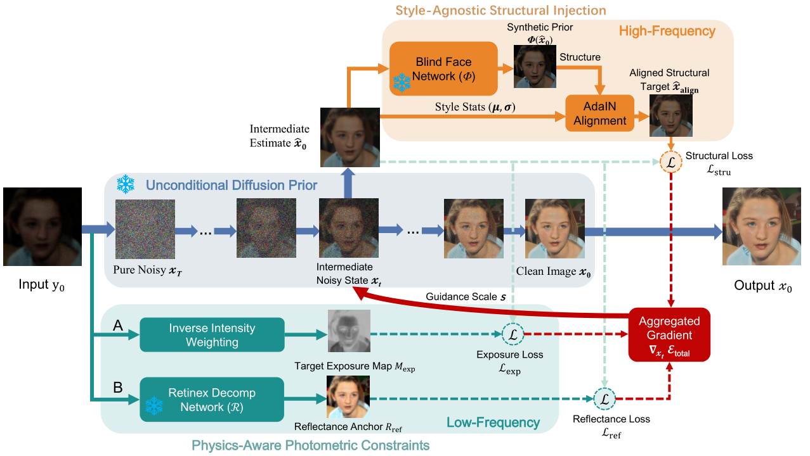

<div align="center">

# PASDiff: Physics-Aware Semantic Guidance for Joint Real-World Low-Light Face Enhancement and Restoration

[Yilin Ni](https://github.com/YlNi26)<sup>1,*</sup> &nbsp;&nbsp; [Wenjie Li](https://24wenjie-li.github.io/)<sup>2,*</sup> &nbsp;&nbsp; [Zhengxue Wang](#)<sup>3</sup> &nbsp;&nbsp; [Juncheng Li](#)<sup>4</sup> &nbsp;&nbsp; [Guangwei Gao](https://guangweigao.github.io/)<sup>3,†</sup> &nbsp;&nbsp; [Jian Yang](https://www.patternrecognition.asia/jian/)<sup>3</sup>

<sup>1</sup>College of Automation, Nanjing University of Posts and Telecommunications, Nanjing, China &nbsp;&nbsp;&nbsp; <sup>2</sup>School of Artificial Intelligence, Beijing University of Posts and Telecommunications, Beijing, China &nbsp;&nbsp;&nbsp; <sup>3</sup>PCA Lab, School of Computer Science and Engineering, Nanjing University of Science and Technology, Nanjing, China &nbsp;&nbsp;&nbsp; <sup>4</sup>School of Computer Science and Technology, East China Normal University, Shanghai, China

🚩 **Accepted to ECCV 2026**

• [ [arXiv](https://arxiv.org/pdf/2603.24969) ] •

<br>



<br>

⭐ *If PASDiff is helpful for you, please consider starring this repo or citing our paper. Thanks!* 🤗

</div>

---

## 📮 Updates

* **2026.07.21:** Codes, checkpoints, and datasets are released.
* **2026.06.23:** This repo is created.


## 🛠️ Dependencies and Installation

```bash
# git clone this repository
git clone [https://github.com/YlNi26/PASDiff.git](https://github.com/YlNi26/PASDiff.git)
cd PASDiff

# create new anaconda env
conda create -n pasdiff python=3.8 -y
conda activate pasdiff

# install python dependencies
conda install mpi4py
pip3 install -r requirements.txt
pip install -e .
```


### 📝 Citation
If our work is useful for your research, please consider citing:

    @inproceedings{ni2026pasdiff,
        title={PASDiff: Physics-Aware Semantic Guidance for Joint Real-world Low-Light Face Enhancement and Restoration},
        author={Ni, Yilin and Li, Wenjie and Wang, Zhengxue and Li, Juncheng and Gao, Guangwei and Yang, Jian},
        booktitle={ECCV},
        year={2026}
    }


### 📧 Contact
If you have any questions, please feel free to reach me out at `lewj2408@gmail.com` or `nixiaolin26@gmail.com`. 
